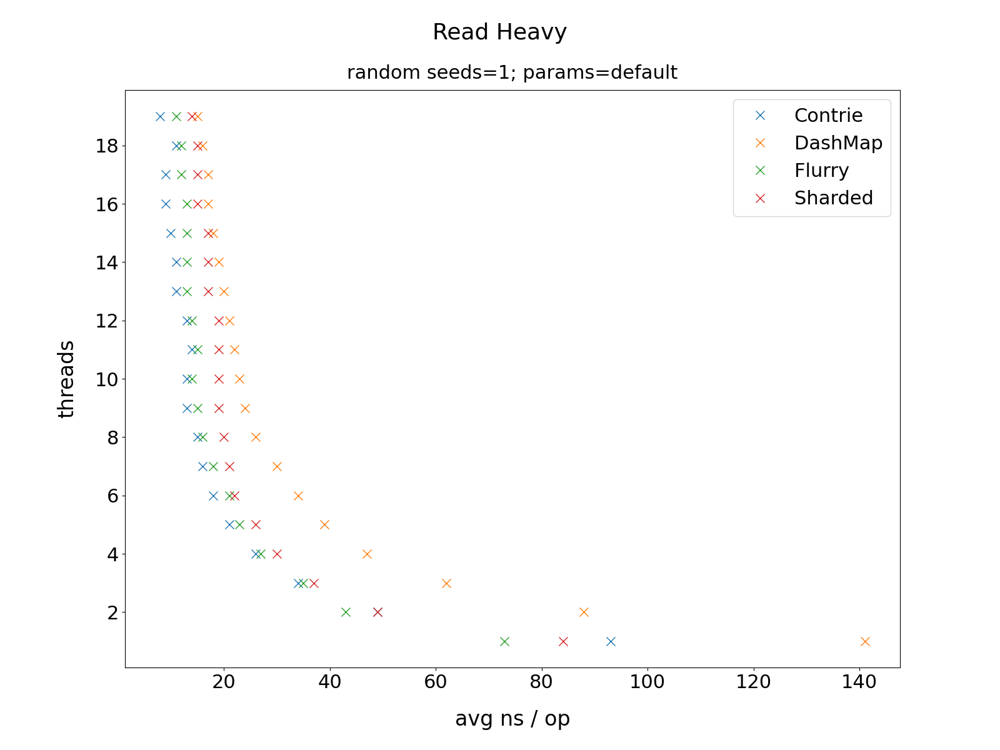
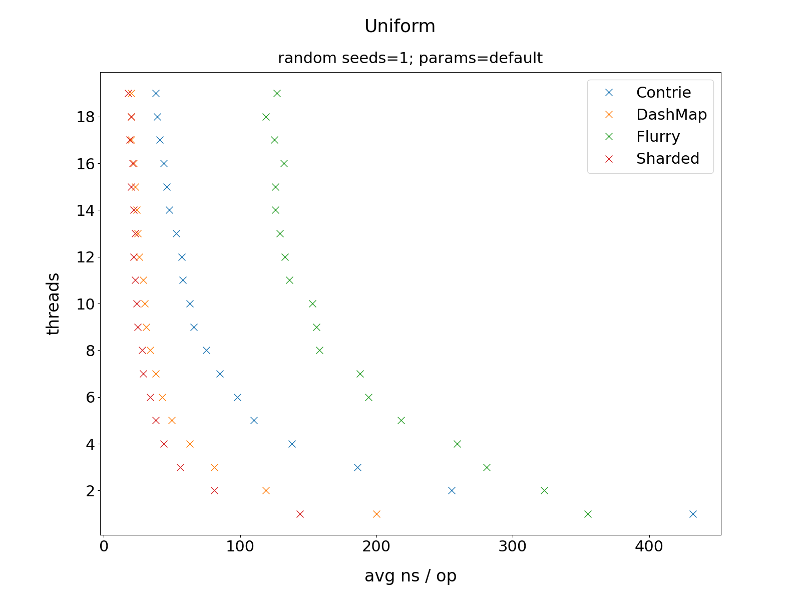

_**Note: This crate is still in early development and undergoing API changes.** Contributions, feature requests, and
constructive feedback are warmly welcomed._

## sharded &emsp; ![Build] ![Crate]

[Build]: https://github.com/nkconnor/sharded/workflows/build/badge.svg
[Crate]: https://img.shields.io/crates/v/sharded

**Sharded provides safe, fast, and obvious concurrent collections in Rust**. This crate splits the
underlying collection into `N shards` each with its own lock. Calling `read(&key)` or `write(&key)`
returns a guard for a single shard.

### Features

* **Zero unsafe code.** This library uses `#![forbid(unsafe_code)]` and was motivated by
the complexity and amount of memory errors present in many alternatives.

* **Tiny footprint.** The core logic is ~100 lines of code. This may build up over time as utilities
and ergonomics are added. By default, the library only uses `std` and `hashbrown`. If you'd like to pull in some community
crates such as `parking_lot`, `ahash`, etc.. just use add the corresponding feature.

* **Really fast.** This implementation may be a more performant choice than some
of the most popular concurrent hashmaps out there. Try it on your workload and let us know.

#### See Also

- **[countrie](https://crates.io/crates/contrie)** - A concurrent hash-trie map & set.
- **[dashmap](https://github.com/xacrimon/dashmap)** - Blazing fast concurrent HashMap for Rust.
- **[flurry](https://github.com/jonhoo/flurry)** - A port of Java's `java.util.concurrent.ConcurrentHashMap` to Rust. (Also part of a live stream series)

### Quick Start

```toml
[dependencies]
# Optionally use `parking_lot`, `ahash`, `fxhash`, and `xxhash`
# by specifing the feature by the same name e.g.
sharded = { version = "0.1.0", features = ["fxhash", "parking_lot"] }
```
#### Examples

**Insert a key value pair**

```rust
let users = Map::new();
users.insert(32, "Henry");
```

**Access a storage shard**

`Map` provides `read` and `write` which give access to the underlying
storage (which is built using `hashbrown::raw`). Both methods return a tuple of `(Key,
Guard<Shard>)`

```rust
let (key, shard) = users.read(&32);
assert_eq!(shard.get(key), Some(&"Henry"));
```

**Determine if a storage shard is locked**

`try_read` and `try_write` are available for avoiding blocks or in situations that could
deadlock

```rust
match users.try_read(&32) {
    Ok((key, mut shard)) => Ok(shard.get(key)),
    Err(WouldBlock) => Err(WouldBlock)
};
```

### Performance Comparison

These measurements were generated using [`jonhoo/bustle`](https://github.com/jonhoo/bustle). To reproduce the charts,
see the `benchmarks` directory. Benchmarks can be misleading. It is recommended to benchmark using a real application
workload.

#### Average Performance by Implementation

This ran each implementation over the presets in [`bustle::Mix`](https://docs.rs/bustle/0.4.2/bustle/struct.Mix.html) for 5
iterations / random seeds using a Intel® Core™ i9-9820X. Lower numbers are better. Approaches using a single `std::sync` Lock and `chashmap` were discarded for clarity (they are
a lot slower). If you know why `chashmap` is so slow in this test, please help here.






### Acknowledgements

Many thanks to

- [Reddit community](https://www.reddit.com/r/rust) for a few pointers and
some motivation to take this project further.

- [Jon Gjengset](https://github.com/jonhoo) for the live streams and utility crates involved

- and countless OSS contributors that made this work possible

### License

Licensed under either of <a href="LICENSE-APACHE">Apache License, Version
2.0</a> or <a href="LICENSE-MIT">MIT license</a> at your option.

Unless you explicitly state otherwise, any contribution intentionally submitted
for inclusion in `sharded` by you, as defined in the Apache-2.0 license, shall be
dual licensed as above, without any additional terms or conditions.

License: MIT OR Apache-2.0
